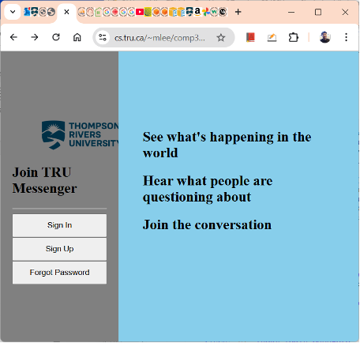
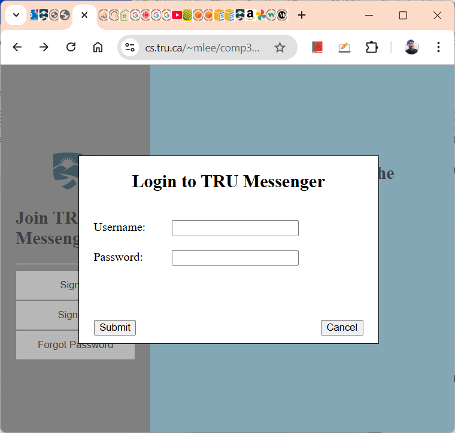

The app includes two panes, Navigation on the left and Content on the right. On Navigation, there are two buttons for SignIn and SignUp.
 
•	Navigation and Content have the fully stretched height on the viewport. The sum of widths of Navigation and Content should be the width of the viewport.
•	The SignIn button is used to display the SignIn modal window, that consists of a blanket and a popup box, over the viewport. The popup box should be displayed at the horizontal and vertical center on the viewport.
•	The SignUp button is used in the same way for the SignUp modal window.
     
•	Clicking the blanket or the Cancel button should remove the modal window.
•	When the Submit button is clicked, <input> names and values should be submitted to w4_controller_1234.php using the POST method.
•	After you implement the above app, upload it to cs.tru.ca. 
•	Test if your application on cs.tru.ca is accessible using a web browser.
•	Notes
o	You should use the W3C event-registration model, not the inline model and the traditional model.

